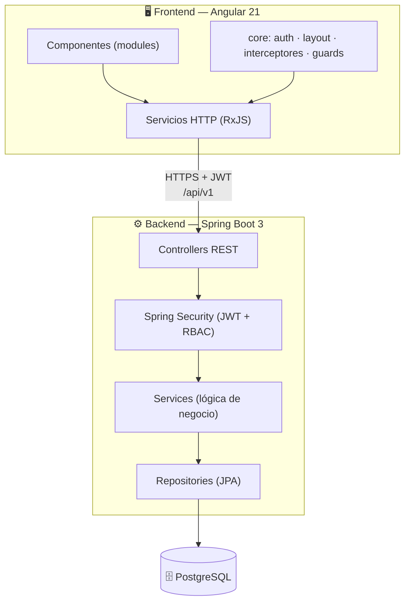
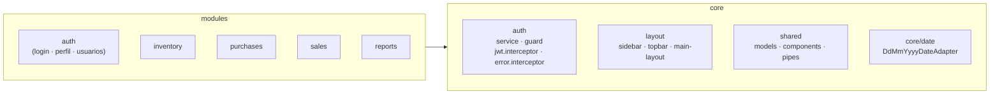
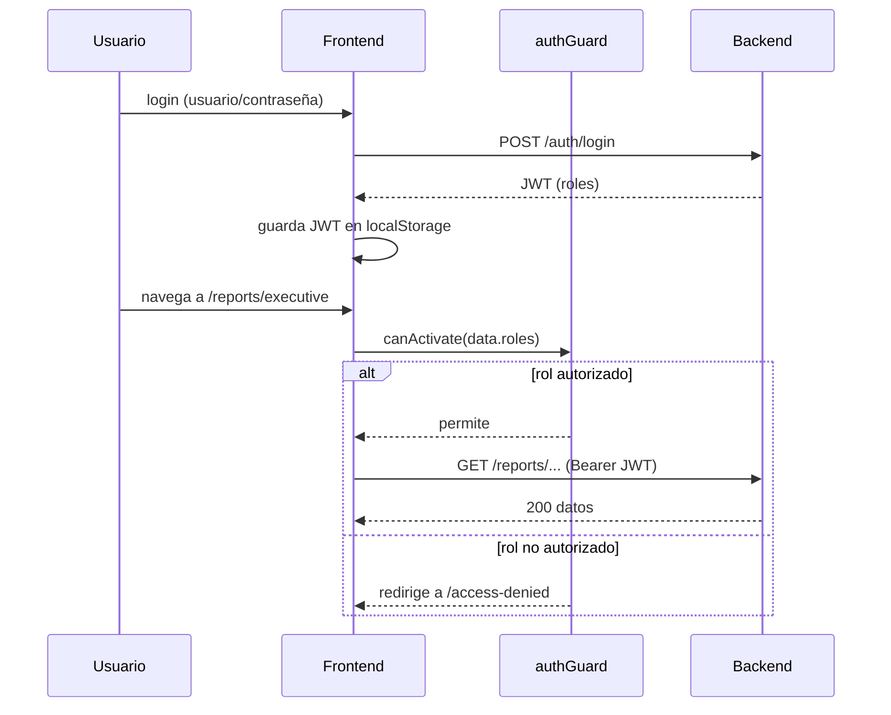
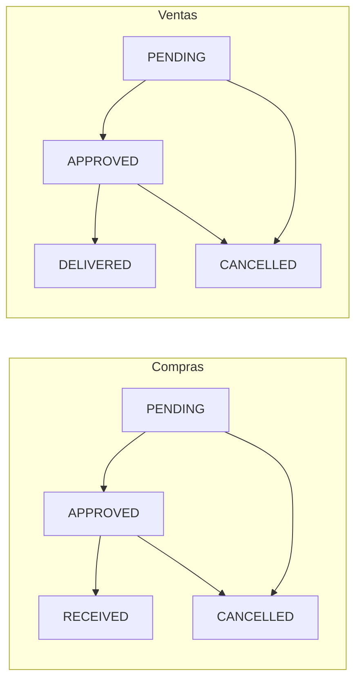

# Diagrama de arquitectura — Frontend

> Diagramas en [Mermaid](https://mermaid.js.org/) (se renderizan automáticamente en GitHub).

## Vista de capas (sistema completo)

## Estructura interna del frontend

## Flujo de autenticación y autorización

## Máquinas de estado (negocio)

